# ERD and domain decisions

The schema stores source data and relationships needed by every current screen. Presentation values such as formatted dates, distances, completion percentages, remaining days, and share-image layouts are derived by the application.

```mermaid
erDiagram
  regions o|--o{ regions : contains
  regions o|--o{ users : home_region
  regions o|--o{ gyms : locates
  users ||--o{ refresh_sessions : authenticates
  users o|--o{ audit_events : acts
  users o|--o{ media_assets : owns
  users ||--o{ saved_gyms : saves
  users ||--o{ memberships : owns
  users ||--o{ climbing_records : creates

  gym_brands o|--o{ gyms : groups
  gyms ||--o{ gym_sources : verifies
  gyms ||--o{ gym_media : displays
  gyms ||--o{ gym_prices : charges
  media_assets ||--o| gym_media : stores
  gyms ||--o{ gym_operating_hours : opens
  gyms ||--o{ gym_operating_hour_overrides : overrides
  gyms ||--o{ gym_tag_assignments : tagged
  gym_tags ||--o{ gym_tag_assignments : classifies
  gyms ||--o{ gym_grades : defines
  gyms ||--o{ gym_walls : contains
  gym_walls ||--o{ gym_sectors : contains
  media_assets o|--o{ gym_walls : maps
  media_assets o|--o{ gym_sectors : maps
  gyms ||--o{ setting_events : schedules
  setting_events ||--o{ setting_event_sectors : changes
  gym_sectors ||--o{ setting_event_sectors : included
  gyms ||--o{ saved_gyms : is_saved

  memberships ||--|{ membership_gyms : applies_to
  gyms ||--o{ membership_gyms : accepts
  memberships o|--o{ climbing_records : used_for
  memberships ||--o{ membership_usages : ledger
  climbing_records o|--o{ membership_usages : causes

  gyms ||--o{ climbing_records : hosts
  climbing_records ||--o{ record_pauses : pauses
  climbing_records ||--o{ record_counts : contains
  gym_grades ||--o{ record_counts : classifies
  gym_sectors ||--o{ record_counts : locates
  climbing_records ||--o{ record_shares : shares
  media_assets o|--o{ record_shares : renders

  regions {
    text code PK
    text parent_code
    text name
    integer level
  }
  users {
    uuid id PK
    text display_name
    text email UK
    text password_hash
    user_role role
    text home_region_code FK
  }
  media_assets {
    uuid id PK
    uuid owner_user_id FK
    text storage_key UK
    text content_type
    integer byte_size
    text checksum_sha256
    media_status status
  }
  gym_brands {
    uuid id PK
    text name UK
    text website_url
    text instagram_url
  }
  gyms {
    uuid id PK
    uuid brand_id FK
    text name
    text branch_name
    text address
    text region_code FK
    float8 latitude
    float8 longitude
    text phone
    text website_url
    text instagram_url
    text nearby_directions
    text operating_hours_note
    text parking_info
    gym_operation_status operation_status
    text calendar_color
    text calendar_text_color
    text_array facilities
  }
  gym_sources {
    uuid id PK
    uuid gym_id FK
    gym_source_type type
    text source_name
    text source_url
    text external_id
    timestamptz verified_at
    timestamptz last_checked_at
    jsonb metadata
  }
  gym_media {
    uuid id PK
    uuid gym_id FK
    uuid media_asset_id FK
    gym_media_type type
    text alt_text
    integer sort_order
  }
  gym_prices {
    uuid id PK
    uuid gym_id FK
    gym_price_type type
    integer amount
    text currency
    text raw_text
  }
  gym_operating_hours {
    uuid id PK
    uuid gym_id FK
    integer day_of_week
    integer sequence
    time opens_at
    time closes_at
    boolean is_closed
  }
  gym_operating_hour_overrides {
    uuid id PK
    uuid gym_id FK
    date date
    integer sequence
    time opens_at
    time closes_at
    boolean is_closed
    text note
  }
  gym_tags {
    uuid id PK
    text code UK
    text label
  }
  gym_tag_assignments {
    uuid gym_id PK,FK
    uuid tag_id PK,FK
  }
  gym_grades {
    uuid id PK
    uuid gym_id FK
    text code
    text label
    text color
    text standard_code
    integer rank
  }
  gym_walls {
    uuid id PK
    uuid gym_id FK
    text code
    text name
    integer sort_order
    boolean is_active
    uuid map_media_asset_id FK
  }
  gym_sectors {
    uuid id PK
    uuid gym_id FK
    uuid wall_id FK
    text code
    text name
    integer sort_order
    boolean is_active
    uuid map_media_asset_id FK
  }
  setting_events {
    uuid id PK
    uuid gym_id FK
    text title
    setting_event_status status
    timestamptz starts_at
    timestamptz ends_at
    text note
  }
  setting_event_sectors {
    uuid setting_event_id PK,FK
    uuid gym_sector_id PK,FK
    uuid gym_id FK
  }
  memberships {
    uuid id PK
    uuid user_id FK
    text name
    membership_type type
    integer total_uses
    integer remaining_uses
    timestamptz valid_from
    timestamptz valid_until
    text note
    boolean home_favorite
    integer home_order
    timestamptz archived_at
  }
  membership_gyms {
    uuid membership_id PK,FK
    uuid gym_id PK,FK
  }
  membership_usages {
    uuid id PK
    uuid membership_id FK
    uuid record_id FK
    membership_usage_type type
    integer delta
    integer balance_after
    text note
    timestamptz occurred_at
  }
  climbing_records {
    uuid id PK
    uuid user_id FK
    uuid gym_id FK
    uuid membership_id FK
    record_access_type access_type
    record_status status
    timestamptz started_at
    timestamptz ended_at
    integer active_duration_seconds
    numeric rating
    record_mode mode
    text note
  }
  record_pauses {
    uuid id PK
    uuid record_id FK
    timestamptz paused_at
    timestamptz resumed_at
  }
  record_counts {
    uuid id PK
    uuid record_id FK
    uuid gym_id FK
    uuid gym_grade_id FK
    uuid gym_sector_id FK
    integer attempts
    integer sends
  }
  record_shares {
    uuid id PK
    uuid record_id FK
    text token_hash UK
    uuid media_asset_id FK
    record_share_status status
    timestamptz expires_at
    timestamptz revoked_at
  }
```

## Screen coverage

- Gym search uses structured regions, canonical facilities and tags, coordinates, operation status, saved gyms, day-pass prices, and cover media.
- Gym detail uses ordered media, weekly and exceptional operating hours, access directions, grades, walls, sectors, maps, and setting events.
- Home derives recent gyms and summaries from records and combines membership, setting-event, and gym APIs.
- Record start explicitly distinguishes `day_pass`, `membership`, and `other`; a membership must list the selected gym in `membership_gyms`.
- Active records use start, recovery, draft-count replacement, pause, resume, complete, and cancel APIs. One active record is allowed per user, and completion derives pause-aware `active_duration_seconds` on the server.
- Record details use real sector and grade foreign keys rather than display strings.
- Membership cards derive remaining days and labels; count changes are recorded in `membership_usages`.
- Profile counts are derived from saved gyms, active memberships, and completed records.
- Share images live in S3 through `media_assets`; `record_shares` stores only hashed public tokens, while owner listings expose revocable IDs and lifecycle state without raw tokens.

## Storage rules

- S3 object bodies are never stored in PostgreSQL. `media_assets.storage_key` identifies the object and API responses derive its public URL from `MEDIA_PUBLIC_BASE_URL`.
- Each gym has at most one `logo` and one `cover`, and can have multiple ordered `photo` rows. One S3 asset may be referenced by multiple roles for the same gym, so the initial logo can also serve as its cover and first detail image.
- `gym_media` defines image role and order. Wall and sector maps directly reference media assets.
- Gym facts retain provenance in `gym_sources`; source metadata must not contain copied reviews, photos, or personal data.
- Weekly hours support multiple intervals per day. Date-specific closures and changed hours override the weekly schedule.
- Coordinates are either both null or both present and must be valid latitude/longitude values.
- A setting event can affect multiple sectors. Event and sector gym coherence is enforced by the writing service.
- Count memberships require valid totals and balances. Period memberships have no count fields.
- A membership can apply to multiple gyms. Zero eligible gyms means an unassigned pass that cannot yet be used for a record.
- Gym prices retain a normalized KRW amount when parseable and the original researched text for uncertainty and later review.
- Count membership consumption, restoration, and manual correction use an append-only ledger.
- Completed and cancelled records require `ended_at`; in-progress records require it to be null.
- Membership access requires `membership_id`; day-pass and other access forbid it.
- Rating is null or a half-step from 0.5 through 5.0.
- Composite foreign keys enforce that record, grade, and sector share one gym; record membership ownership and eligible-gym membership are also database constraints.
- Completed records are immutable in the current API. Active cancellation happens before membership consumption; future correction/deletion must append a matching restore ledger entry.
- Public share tokens are returned once and only SHA-256 hashes are persisted. Revocation and expiration are independent of S3 object deletion.

## Derived values

Do not persist formatted dates, durations, completion rates, remaining-day labels, distances, monthly totals, recent-gym labels, result counts, or share-card layout text. Duration uses `active_duration_seconds` when present and otherwise derives from timestamps and pause intervals.

## Deferred infrastructure

- Direct browser-to-S3 upload signing and asynchronous malware scanning beyond strict server-side image decoding
- PostGIS activation for larger-scale distance queries
- Operator self-service claims and source verification workflow
- Notification subscriptions and delivery
