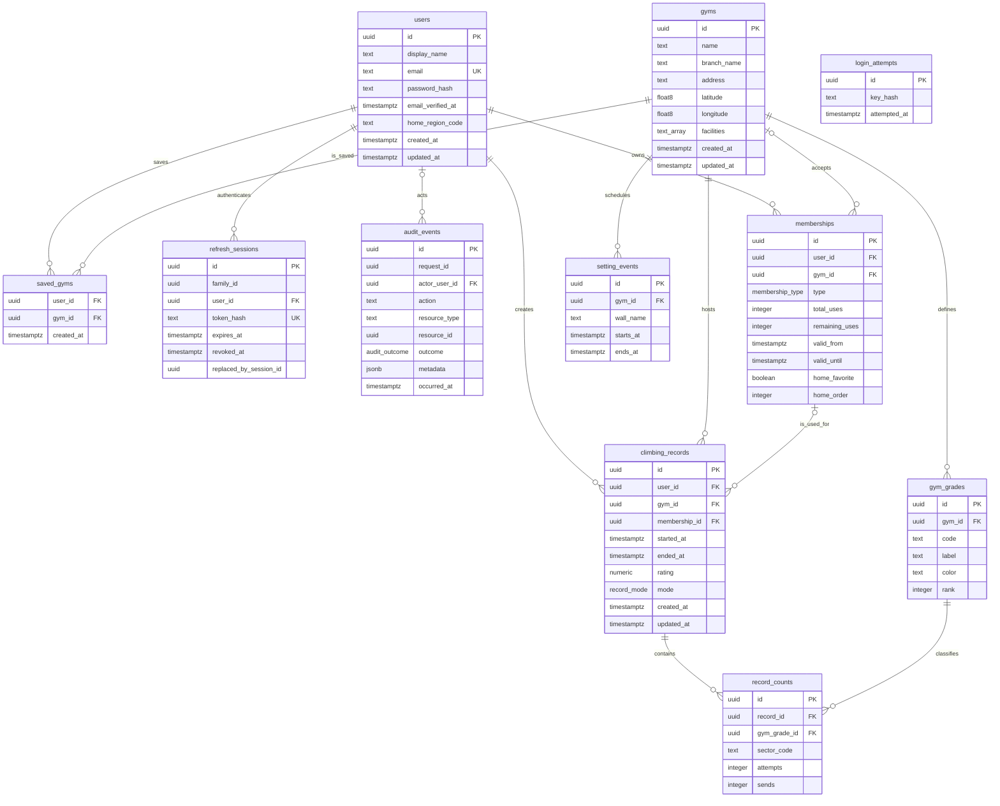

# ERD and domain decisions

## Storage rules

- IDs are UUIDs generated by PostgreSQL.
- Emails are normalized to lowercase; passwords are stored only as Argon2id hashes.
- Refresh JWTs are represented by SHA-256 hashes and rotate within a token family.
- `audit_events` is append-only application data. No update or delete API exists.
- All timestamps are stored as `timestamptz`; clients send ISO 8601 values with an offset.
- Duration, Korean date labels, remaining-day labels, and calendar summaries are presentation values and are not stored.
- A gym owns its grade scale. A record count can only refer to a grade belonging to the record's gym.
- `attempts` includes successful attempts, so `0 <= sends <= attempts`.
- A record can contain multiple sectors at the same grade. `(record_id, gym_grade_id, sector_code)` uses `NULLS NOT DISTINCT` uniqueness.
- Count memberships require nonnegative `total_uses` and `remaining_uses`; period memberships require both fields to be null.
- A record's membership reference is nullable because a daily pass or an unregistered pass may be used.
- Deleting a record deletes its counts. Deleting a gym with records is restricted.
- The maximum of three home-favorite memberships is a transactional service rule, not a row-level database constraint.

## Deferred decisions

- Email verification delivery, password recovery, and account linking
- Whether creating a record automatically decrements a count membership
- Record editing and deletion policy
- Public share URLs and server-generated images
- Distance-based gym recommendations and PostGIS activation
- Notification subscriptions and delivery
